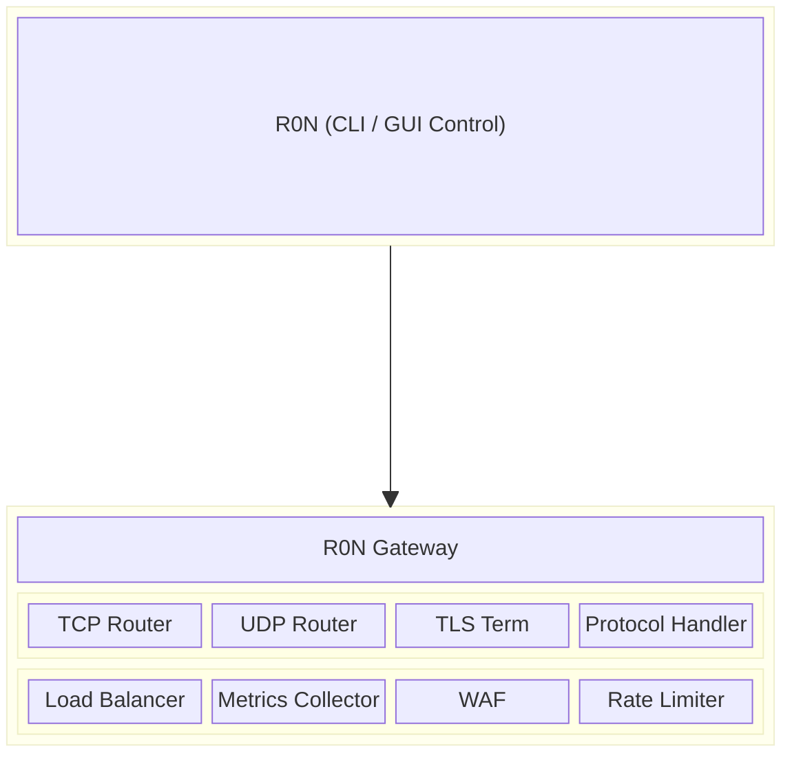

# R0N Ingress

[](https://www.rust-lang.org/)
[](LICENSE)
[](#testing)
[](docs/api.md)

A high-performance, protocol-agnostic ingress controller written in Rust, designed to route, secure, and manage traffic for multiple services and protocols.

## Features

### Networking & Routing

- **Multi-Protocol Support**: TCP, UDP, HTTP/1.1, HTTP/2, HTTP/3, MQTT 3.1.1/5.0, WebSocket, QUIC
- **Layer 4 & Layer 7 Routing**: Stream-based and application-aware routing with path matching
- **TLS Management**: Termination, passthrough, SNI routing, mTLS, and automatic ACME certificates
- **Load Balancing**: Round-robin, least-connections, weighted, random, and IP hash strategies

### Security

- **Rate Limiting**: Token bucket and sliding window algorithms with per-IP/route limits
- **Access Control**: IP allow/deny lists, JWT/API key authentication, policy engine
- **Web Application Firewall**: SQL injection, XSS, and path traversal detection with OWASP CRS support
- **ACME Integration**: Automatic Let's Encrypt certificates with HTTP-01/DNS-01 challenges

### Observability

- **Metrics**: Prometheus-compatible exporter with per-module aggregation
- **Logging**: Structured JSON logging with rotation and sensitive data redaction
- **Distributed Tracing**: OpenTelemetry-compatible with W3C, B3, and Jaeger propagation

### Advanced

- **QUIC/HTTP-3**: RFC 9000/9114 compliant with 0-RTT and connection migration
- **Kubernetes Integration**: Ingress controller, service discovery, ConfigMap/Secret sync
- **Plugin System**: WebAssembly plugins with sandboxing and capability-based security
- **Performance**: Memory pools, connection pooling, zero-copy buffers, benchmarking suite

## Quick Start

### Prerequisites

- Rust 1.75.0 or later

### Build

```bash
cargo build --release
```

### Run

```bash
./target/release/R0N-Gateway
```

## Architecture

R0N Gateway uses a modular architecture where each component implements the `ModuleContract` trait for uniform lifecycle management. The gateway is designed to be orchestrated by **R0N**, a separate control layer that provides both CLI and GUI interfaces.



## Documentation

- [API Reference](docs/api.md) — Complete API documentation
- [User Guide](docs/user-guide.md) — Installation and configuration
- [Deployment Guide](docs/deployment.md) — Docker, Kubernetes, and cloud deployments
- [Module Development](docs/module-development.md) — Creating custom modules
- [Software Requirements Specification](srs.md)
- [Project Milestones](milestones.md)

## Configuration

R0N Gateway uses TOML for configuration. Example:

```toml
[gateway]
name = "my-gateway"
log_level = "info"

[[listeners]]
protocol = "tcp"
address = "0.0.0.0:8080"

[[routes]]
match = { port = 8080 }
backend = { address = "127.0.0.1:3000" }
```

## Module Control Contract

All modules implement a standardized interface for lifecycle management:

| Command   | Description                          |
| --------- | ------------------------------------ |
| `init`    | Initialize module with configuration |
| `start`   | Begin processing                     |
| `stop`    | Graceful shutdown                    |
| `reload`  | Hot-reload configuration             |
| `status`  | Report health and state              |
| `metrics` | Expose module-specific metrics       |

## Development

```bash
# Format code
cargo fmt

# Run linter
cargo clippy -- -D warnings

# Run tests
cargo test --lib

# Build documentation
cargo doc --open
```

### Testing

The project maintains comprehensive test coverage:

```bash
$ cargo test --lib
test result: ok. 1037 passed; 0 failed; 0 ignored
```

### Project Structure

```text
src/
├── lib.rs              # Library root
├── main.rs             # Binary entry point
├── ipc/                # IPC communication layer
│   ├── client.rs       # IPC client
│   ├── message.rs      # Message types & ModuleContract trait
│   └── server.rs       # IPC server
├── modules/            # Gateway modules
│   ├── tcp_router/     # TCP routing
│   ├── udp_router/     # UDP routing
│   ├── tls_terminator/ # TLS termination
│   ├── load_balancer/  # Load balancing
│   ├── http_handler/   # HTTP/1.1 & HTTP/2
│   ├── http3/          # HTTP/3
│   ├── quic/           # QUIC transport
│   ├── mqtt_handler/   # MQTT 3.1.1/5.0
│   ├── websocket_handler/
│   ├── rate_limiting/  # Rate limiting
│   ├── access_control/ # Auth & authorization
│   ├── waf/            # Web application firewall
│   ├── acme/           # ACME certificates
│   ├── metrics_collector/
│   ├── logging/        # Structured logging
│   ├── tracing/        # Distributed tracing
│   ├── k8s/            # Kubernetes integration
│   ├── plugin/         # WASM plugin system
│   └── l4_passthrough/ # L4 passthrough
└── perf/               # Performance utilities
    ├── benchmark.rs    # Benchmarking framework
    ├── memory.rs       # Memory pools & arenas
    ├── connection_pool.rs
    └── zero_copy.rs    # Zero-copy buffers
```

## Contributing

See [CONTRIBUTING.md](CONTRIBUTING.md) for guidelines.

## License

Licensed under the Apache License, Version 2.0. See [LICENSE](LICENSE) for details.
