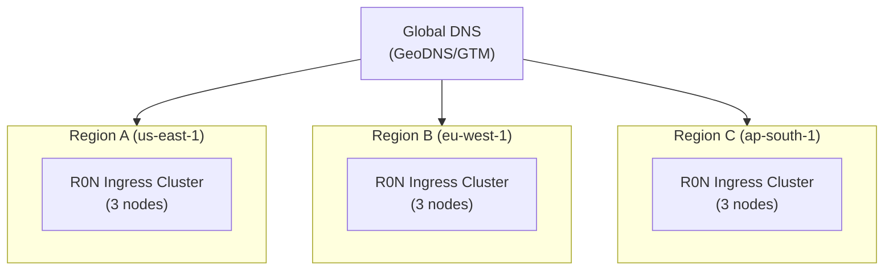

# R0N Ingress — Deployment Guide

## Overview

This guide covers deploying R0N Ingress in production environments, including bare metal, Docker, Kubernetes, and cloud platforms.

---

## Deployment Options

| Option | Best For | Complexity |
| ------ | -------- | ---------- |
| Binary | Single server, bare metal | Low |
| Docker | Container environments | Low |
| Docker Compose | Multi-service setups | Medium |
| Kubernetes | Cloud-native, auto-scaling | High |
| Helm Chart | Kubernetes with customization | Medium |

---

## Binary Deployment

### Building for Production

```bash
# Optimized release build
RUSTFLAGS="-C target-cpu=native" cargo build --release

# Strip debug symbols for smaller binary
strip target/release/r0n-ingress
```

### System Service (systemd)

Create `/etc/systemd/system/r0n-ingress.service`:

```ini
[Unit]
Description=R0N Ingress
Documentation=https://github.com/r0n/r0n-ingress
After=network-online.target
Wants=network-online.target

[Service]
Type=simple
User=r0n
Group=r0n
ExecStart=/usr/local/bin/r0n-ingress --config /etc/r0n/config.toml
ExecReload=/bin/kill -HUP $MAINPID
Restart=on-failure
RestartSec=5s

# Security hardening
NoNewPrivileges=true
ProtectSystem=strict
ProtectHome=true
ReadWritePaths=/var/log/r0n /var/lib/r0n
PrivateTmp=true
CapabilityBoundingSet=CAP_NET_BIND_SERVICE
AmbientCapabilities=CAP_NET_BIND_SERVICE

# Resource limits
LimitNOFILE=65535
LimitNPROC=4096

[Install]
WantedBy=multi-user.target
```

Enable and start:

```bash
sudo systemctl daemon-reload
sudo systemctl enable r0n-ingress
sudo systemctl start r0n-ingress
```

### Directory Structure

```text
/etc/r0n/
├── config.toml           # Main configuration
├── certs/                 # TLS certificates
│   ├── example.com.pem
│   └── example.com.key
├── plugins/               # WASM plugins
└── acme/                  # ACME certificates

/var/log/r0n/
├── gateway.log           # Application logs
└── threats.log           # WAF threat logs

/var/lib/r0n/
└── state/                # Persistent state
```

---

## Docker Deployment

### Dockerfile

```dockerfile
FROM rust:1.75-alpine AS builder

RUN apk add --no-cache musl-dev openssl-dev openssl-libs-static

WORKDIR /build
COPY . .

RUN RUSTFLAGS="-C target-feature=-crt-static" \
    cargo build --release

FROM alpine:3.19

RUN apk add --no-cache ca-certificates libssl3

RUN adduser -D -u 1000 r0n

COPY --from=builder /build/target/release/r0n-ingress /usr/local/bin/

USER r0n

EXPOSE 8080 8443 9090

ENTRYPOINT ["/usr/local/bin/r0n-ingress"]
CMD ["--config", "/etc/r0n/config.toml"]
```

### Running with Docker

```bash
# Basic run
docker run -d \
  --name r0n-ingress \
  -p 8080:8080 \
  -p 8443:8443 \
  -p 9090:9090 \
  -v /path/to/config:/etc/r0n:ro \
  -v /path/to/certs:/etc/r0n/certs:ro \
  ghcr.io/r0n/r0n-ingress:latest

# With resource limits
docker run -d \
  --name r0n-ingress \
  --memory="512m" \
  --cpus="2" \
  --ulimit nofile=65535:65535 \
  -p 8080:8080 \
  ghcr.io/r0n/r0n-ingress:latest
```

### Docker Compose

```yaml
version: '3.8'

services:
  r0n-ingress:
    image: ghcr.io/r0n/r0n-ingress:latest
    container_name: r0n-ingress
    restart: unless-stopped
    ports:
      - "80:8080"
      - "443:8443"
      - "9090:9090"
    volumes:
      - ./config:/etc/r0n:ro
      - ./certs:/etc/r0n/certs:ro
      - logs:/var/log/r0n
      - acme:/var/lib/r0n/acme
    environment:
      - R0N_GLOBAL_LOG_LEVEL=info
    deploy:
      resources:
        limits:
          memory: 512M
          cpus: '2'
    healthcheck:
      test: ["CMD", "wget", "-q", "--spider", "http://localhost:8080/health"]
      interval: 30s
      timeout: 10s
      retries: 3
    networks:
      - frontend
      - backend

  prometheus:
    image: prom/prometheus:latest
    volumes:
      - ./prometheus.yml:/etc/prometheus/prometheus.yml:ro
    ports:
      - "9091:9090"
    networks:
      - backend

volumes:
  logs:
  acme:

networks:
  frontend:
  backend:
```

---

## Kubernetes Deployment

### Namespace and RBAC

```yaml
# namespace.yaml
apiVersion: v1
kind: Namespace
metadata:
  name: r0n-system
  labels:
    app.kubernetes.io/name: r0n-ingress

---
# serviceaccount.yaml
apiVersion: v1
kind: ServiceAccount
metadata:
  name: r0n-ingress
  namespace: r0n-system

---
# clusterrole.yaml
apiVersion: rbac.authorization.k8s.io/v1
kind: ClusterRole
metadata:
  name: r0n-ingress
rules:
  - apiGroups: [""]
    resources: ["services", "endpoints", "secrets", "configmaps"]
    verbs: ["get", "list", "watch"]
  - apiGroups: ["networking.k8s.io"]
    resources: ["ingresses", "ingressclasses"]
    verbs: ["get", "list", "watch"]
  - apiGroups: ["networking.k8s.io"]
    resources: ["ingresses/status"]
    verbs: ["update"]
  - apiGroups: ["coordination.k8s.io"]
    resources: ["leases"]
    verbs: ["get", "create", "update"]

---
# clusterrolebinding.yaml
apiVersion: rbac.authorization.k8s.io/v1
kind: ClusterRoleBinding
metadata:
  name: r0n-ingress
roleRef:
  apiGroup: rbac.authorization.k8s.io
  kind: ClusterRole
  name: r0n-ingress
subjects:
  - kind: ServiceAccount
    name: r0n-ingress
    namespace: r0n-system
```

### ConfigMap

```yaml
# configmap.yaml
apiVersion: v1
kind: ConfigMap
metadata:
  name: r0n-ingress-config
  namespace: r0n-system
data:
  config.toml: |
    [global]
    log_level = "info"
    
    [kubernetes]
    enabled = true
    ingress_class = "r0n"
    
    [kubernetes.config]
    type = "in_cluster"
    
    [load_balancer]
    strategy = "least_connections"
    
    [load_balancer.health_check]
    enabled = true
    interval = "10s"
    
    [metrics]
    bind_address = "0.0.0.0:9090"
    path = "/metrics"
    
    [tracing]
    enabled = true
    service_name = "r0n-ingress"
    
    [tracing.exporter]
    type = "otlp"
    endpoint = "http://otel-collector.observability:4317"
```

### Deployment

```yaml
# deployment.yaml
apiVersion: apps/v1
kind: Deployment
metadata:
  name: r0n-ingress
  namespace: r0n-system
  labels:
    app.kubernetes.io/name: r0n-ingress
spec:
  replicas: 3
  selector:
    matchLabels:
      app.kubernetes.io/name: r0n-ingress
  template:
    metadata:
      labels:
        app.kubernetes.io/name: r0n-ingress
      annotations:
        prometheus.io/scrape: "true"
        prometheus.io/port: "9090"
        prometheus.io/path: "/metrics"
    spec:
      serviceAccountName: r0n-ingress
      securityContext:
        runAsNonRoot: true
        runAsUser: 1000
        fsGroup: 1000
      containers:
        - name: r0n-ingress
          image: ghcr.io/r0n/r0n-ingress:latest
          imagePullPolicy: Always
          args:
            - --config
            - /etc/r0n/config.toml
          ports:
            - name: http
              containerPort: 8080
              protocol: TCP
            - name: https
              containerPort: 8443
              protocol: TCP
            - name: metrics
              containerPort: 9090
              protocol: TCP
          resources:
            requests:
              cpu: 100m
              memory: 128Mi
            limits:
              cpu: 1000m
              memory: 512Mi
          livenessProbe:
            httpGet:
              path: /health
              port: 8080
            initialDelaySeconds: 10
            periodSeconds: 10
            timeoutSeconds: 5
            failureThreshold: 3
          readinessProbe:
            httpGet:
              path: /ready
              port: 8080
            initialDelaySeconds: 5
            periodSeconds: 5
            timeoutSeconds: 3
            failureThreshold: 3
          volumeMounts:
            - name: config
              mountPath: /etc/r0n
              readOnly: true
            - name: tls
              mountPath: /etc/r0n/certs
              readOnly: true
          securityContext:
            allowPrivilegeEscalation: false
            readOnlyRootFilesystem: true
            capabilities:
              drop:
                - ALL
      volumes:
        - name: config
          configMap:
            name: r0n-ingress-config
        - name: tls
          secret:
            secretName: r0n-ingress-tls
      affinity:
        podAntiAffinity:
          preferredDuringSchedulingIgnoredDuringExecution:
            - weight: 100
              podAffinityTerm:
                labelSelector:
                  matchLabels:
                    app.kubernetes.io/name: r0n-ingress
                topologyKey: kubernetes.io/hostname
      topologySpreadConstraints:
        - maxSkew: 1
          topologyKey: topology.kubernetes.io/zone
          whenUnsatisfiable: ScheduleAnyway
          labelSelector:
            matchLabels:
              app.kubernetes.io/name: r0n-ingress
```

### Service

```yaml
# service.yaml
apiVersion: v1
kind: Service
metadata:
  name: r0n-ingress
  namespace: r0n-system
  labels:
    app.kubernetes.io/name: r0n-ingress
spec:
  type: LoadBalancer
  externalTrafficPolicy: Local
  ports:
    - name: http
      port: 80
      targetPort: 8080
      protocol: TCP
    - name: https
      port: 443
      targetPort: 8443
      protocol: TCP
  selector:
    app.kubernetes.io/name: r0n-ingress

---
# metrics-service.yaml
apiVersion: v1
kind: Service
metadata:
  name: r0n-ingress-metrics
  namespace: r0n-system
  labels:
    app.kubernetes.io/name: r0n-ingress
spec:
  type: ClusterIP
  ports:
    - name: metrics
      port: 9090
      targetPort: 9090
  selector:
    app.kubernetes.io/name: r0n-ingress
```

### IngressClass

```yaml
# ingressclass.yaml
apiVersion: networking.k8s.io/v1
kind: IngressClass
metadata:
  name: r0n
  annotations:
    ingressclass.kubernetes.io/is-default-class: "true"
spec:
  controller: r0n.io/gateway
```

### Horizontal Pod Autoscaler

```yaml
# hpa.yaml
apiVersion: autoscaling/v2
kind: HorizontalPodAutoscaler
metadata:
  name: r0n-ingress
  namespace: r0n-system
spec:
  scaleTargetRef:
    apiVersion: apps/v1
    kind: Deployment
    name: r0n-ingress
  minReplicas: 3
  maxReplicas: 10
  metrics:
    - type: Resource
      resource:
        name: cpu
        target:
          type: Utilization
          averageUtilization: 70
    - type: Resource
      resource:
        name: memory
        target:
          type: Utilization
          averageUtilization: 80
    - type: Pods
      pods:
        metric:
          name: r0n_active_connections
        target:
          type: AverageValue
          averageValue: "1000"
  behavior:
    scaleDown:
      stabilizationWindowSeconds: 300
      policies:
        - type: Percent
          value: 10
          periodSeconds: 60
    scaleUp:
      stabilizationWindowSeconds: 0
      policies:
        - type: Percent
          value: 100
          periodSeconds: 15
        - type: Pods
          value: 4
          periodSeconds: 15
      selectPolicy: Max
```

### Pod Disruption Budget

```yaml
# pdb.yaml
apiVersion: policy/v1
kind: PodDisruptionBudget
metadata:
  name: r0n-ingress
  namespace: r0n-system
spec:
  minAvailable: 2
  selector:
    matchLabels:
      app.kubernetes.io/name: r0n-ingress
```

---

## Cloud Platform Deployments

### AWS

**EKS with ALB:**

```yaml
# Use AWS Load Balancer Controller annotations
apiVersion: v1
kind: Service
metadata:
  name: r0n-ingress
  namespace: r0n-system
  annotations:
    service.beta.kubernetes.io/aws-load-balancer-type: "nlb"
    service.beta.kubernetes.io/aws-load-balancer-cross-zone-load-balancing-enabled: "true"
    service.beta.kubernetes.io/aws-load-balancer-backend-protocol: "tcp"
spec:
  type: LoadBalancer
  # ...
```

**EC2 with Auto Scaling:**

```bash
# User data script for EC2 instances
#!/bin/bash
yum install -y docker
systemctl start docker
docker run -d \
  --name r0n-ingress \
  --restart always \
  -p 80:8080 \
  -p 443:8443 \
  -v /etc/r0n:/etc/r0n:ro \
  ghcr.io/r0n/r0n-ingress:latest
```

### Google Cloud (GKE)

```yaml
# Use GKE Ingress annotations
apiVersion: v1
kind: Service
metadata:
  name: r0n-ingress
  namespace: r0n-system
  annotations:
    cloud.google.com/neg: '{"ingress": true}'
    cloud.google.com/backend-config: '{"default": "r0n-backend-config"}'
spec:
  type: ClusterIP
  # ...

---
apiVersion: cloud.google.com/v1
kind: BackendConfig
metadata:
  name: r0n-backend-config
  namespace: r0n-system
spec:
  healthCheck:
    checkIntervalSec: 10
    timeoutSec: 5
    healthyThreshold: 2
    unhealthyThreshold: 3
    type: HTTP
    requestPath: /health
    port: 8080
```

### Azure (AKS)

```yaml
# Use Azure Load Balancer annotations
apiVersion: v1
kind: Service
metadata:
  name: r0n-ingress
  namespace: r0n-system
  annotations:
    service.beta.kubernetes.io/azure-load-balancer-internal: "false"
    service.beta.kubernetes.io/azure-dns-label-name: "r0n-ingress"
spec:
  type: LoadBalancer
  # ...
```

---

## High Availability

### Multi-Region Deployment



### Configuration Sync

Use a shared configuration store:

```toml
[config]
sync_enabled = true
sync_backend = "etcd"  # or "consul", "redis"
sync_endpoints = ["etcd1:2379", "etcd2:2379", "etcd3:2379"]
sync_interval = "30s"
```

---

## Performance Tuning

### System Limits

```bash
# /etc/sysctl.conf
net.core.somaxconn = 65535
net.core.netdev_max_backlog = 65535
net.ipv4.tcp_max_syn_backlog = 65535
net.ipv4.ip_local_port_range = 1024 65535
net.ipv4.tcp_tw_reuse = 1
net.ipv4.tcp_fin_timeout = 15
net.core.rmem_max = 16777216
net.core.wmem_max = 16777216

# Apply changes
sysctl -p
```

### File Descriptor Limits

```bash
# /etc/security/limits.conf
r0n soft nofile 65535
r0n hard nofile 65535
r0n soft nproc 65535
r0n hard nproc 65535
```

### Recommended Configuration

```toml
[global]
worker_threads = 0  # Auto-detect (uses num_cpus)

[tcp_router]
buffer_size = 16384
connection_timeout = "30s"

[load_balancer]
strategy = "least_connections"

[load_balancer.health_check]
interval = "5s"
timeout = "2s"

[http_handler]
http2_enabled = true
max_concurrent_streams = 100
```

---

## Monitoring

### Prometheus Configuration

```yaml
# prometheus.yml
scrape_configs:
  - job_name: 'r0n-ingress'
    kubernetes_sd_configs:
      - role: pod
        namespaces:
          names: ['r0n-system']
    relabel_configs:
      - source_labels: [__meta_kubernetes_pod_label_app_kubernetes_io_name]
        action: keep
        regex: r0n-ingress
      - source_labels: [__meta_kubernetes_pod_container_port_name]
        action: keep
        regex: metrics
```

### Grafana Dashboard

Key panels to include:

- Request rate (requests/second)
- Error rate (4xx/5xx responses)
- Latency percentiles (p50, p95, p99)
- Active connections
- Backend health status
- CPU and memory usage
- Rate limit violations
- WAF blocked requests

### Alerting Rules

```yaml
# alerting-rules.yaml
groups:
  - name: r0n-ingress
    rules:
      - alert: R0NGatewayHighErrorRate
        expr: |
          sum(rate(r0n_requests_total{status=~"5.."}[5m])) /
          sum(rate(r0n_requests_total[5m])) > 0.05
        for: 5m
        labels:
          severity: critical
        annotations:
          summary: High error rate on R0N Ingress
          
      - alert: R0NGatewayHighLatency
        expr: |
          histogram_quantile(0.99, sum(rate(r0n_request_duration_seconds_bucket[5m])) by (le)) > 1
        for: 5m
        labels:
          severity: warning
        annotations:
          summary: High latency on R0N Ingress
          
      - alert: R0NGatewayBackendDown
        expr: r0n_backend_health == 0
        for: 1m
        labels:
          severity: critical
        annotations:
          summary: Backend {{ $labels.backend }} is down
```

---

## Security Hardening

### Network Policies

```yaml
# network-policy.yaml
apiVersion: networking.k8s.io/v1
kind: NetworkPolicy
metadata:
  name: r0n-ingress
  namespace: r0n-system
spec:
  podSelector:
    matchLabels:
      app.kubernetes.io/name: r0n-ingress
  policyTypes:
    - Ingress
    - Egress
  ingress:
    - ports:
        - port: 8080
        - port: 8443
        - port: 9090
  egress:
    - to:
        - namespaceSelector: {}
      ports:
        - port: 443
        - port: 80
    - to:
        - ipBlock:
            cidr: 10.0.0.0/8
```

### Secret Management

```yaml
# Use external secrets operator
apiVersion: external-secrets.io/v1beta1
kind: ExternalSecret
metadata:
  name: r0n-ingress-secrets
  namespace: r0n-system
spec:
  refreshInterval: 1h
  secretStoreRef:
    kind: ClusterSecretStore
    name: vault-backend
  target:
    name: r0n-ingress-secrets
  data:
    - secretKey: tls.crt
      remoteRef:
        key: secret/r0n/tls
        property: certificate
    - secretKey: tls.key
      remoteRef:
        key: secret/r0n/tls
        property: private_key
```

---

## Backup and Recovery

### Configuration Backup

```bash
#!/bin/bash
# backup-config.sh
BACKUP_DIR=/backup/r0n/$(date +%Y%m%d)
mkdir -p $BACKUP_DIR

# Backup configuration
cp -r /etc/r0n/* $BACKUP_DIR/

# Backup certificates
cp -r /etc/r0n/certs $BACKUP_DIR/

# Backup ACME state
cp -r /var/lib/r0n/acme $BACKUP_DIR/

# Compress
tar -czf $BACKUP_DIR.tar.gz $BACKUP_DIR
rm -rf $BACKUP_DIR
```

### Disaster Recovery

1. **RTO (Recovery Time Objective):** < 5 minutes with pre-provisioned standby
2. **RPO (Recovery Point Objective):** Configuration changes only (stateless)

Recovery steps:

```bash
# 1. Deploy new instances
kubectl apply -f deployment.yaml

# 2. Restore configuration
kubectl create configmap r0n-ingress-config --from-file=config.toml

# 3. Restore certificates
kubectl create secret tls r0n-ingress-tls --cert=cert.pem --key=key.pem

# 4. Verify health
kubectl rollout status deployment/r0n-ingress
```

---

## See Also

- [API Documentation](api.md) — Detailed API reference
- [User Guide](user-guide.md) — Installation and usage
- [Module Development Guide](module-development.md) — Creating custom modules
