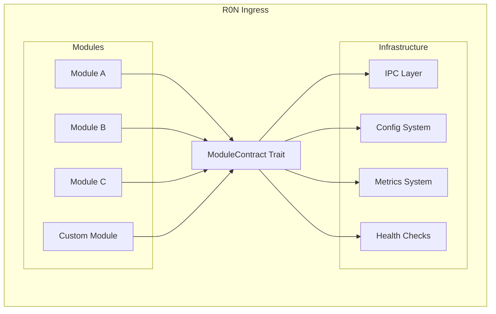

# R0N Ingress — Module Development Guide

## Overview

R0N Ingress uses a modular architecture where each module implements the `ModuleContract` trait. This guide covers creating custom modules that integrate seamlessly with the gateway.

---

## Module Architecture



---

## Quick Start

### 1. Create Module Structure

```text
src/modules/my_module/
├── mod.rs          # Module exports
├── config.rs       # Configuration types
├── error.rs        # Error types
├── handler.rs      # ModuleContract implementation
└── tests.rs        # Unit tests
```

### 2. Define Configuration

```rust
// config.rs
use serde::{Deserialize, Serialize};

#[derive(Debug, Clone, Serialize, Deserialize)]
pub struct MyModuleConfig {
    /// Enable the module
    #[serde(default = "default_enabled")]
    pub enabled: bool,
    
    /// Listen address
    #[serde(default = "default_address")]
    pub address: String,
    
    /// Processing timeout
    #[serde(default = "default_timeout")]
    #[serde(with = "humantime_serde")]
    pub timeout: std::time::Duration,
}

fn default_enabled() -> bool { true }
fn default_address() -> String { "0.0.0.0:8080".into() }
fn default_timeout() -> std::time::Duration { 
    std::time::Duration::from_secs(30) 
}

impl Default for MyModuleConfig {
    fn default() -> Self {
        Self {
            enabled: default_enabled(),
            address: default_address(),
            timeout: default_timeout(),
        }
    }
}

impl MyModuleConfig {
    /// Validate configuration
    pub fn validate(&self) -> Result<(), String> {
        if self.address.is_empty() {
            return Err("address cannot be empty".into());
        }
        if self.timeout.is_zero() {
            return Err("timeout must be positive".into());
        }
        Ok(())
    }
}
```

### 3. Define Error Types

```rust
// error.rs
use std::fmt;

#[derive(Debug)]
pub enum MyModuleError {
    /// Configuration error
    Config(String),
    
    /// I/O error
    Io(std::io::Error),
    
    /// Connection error
    Connection(String),
    
    /// Processing error
    Processing(String),
}

impl fmt::Display for MyModuleError {
    fn fmt(&self, f: &mut fmt::Formatter<'_>) -> fmt::Result {
        match self {
            Self::Config(msg) => write!(f, "configuration error: {}", msg),
            Self::Io(err) => write!(f, "I/O error: {}", err),
            Self::Connection(msg) => write!(f, "connection error: {}", msg),
            Self::Processing(msg) => write!(f, "processing error: {}", msg),
        }
    }
}

impl std::error::Error for MyModuleError {
    fn source(&self) -> Option<&(dyn std::error::Error + 'static)> {
        match self {
            Self::Io(err) => Some(err),
            _ => None,
        }
    }
}

impl From<std::io::Error> for MyModuleError {
    fn from(err: std::io::Error) -> Self {
        Self::Io(err)
    }
}

/// Result type alias for this module
pub type Result<T> = std::result::Result<T, MyModuleError>;
```

### 4. Implement ModuleContract

```rust
// handler.rs
use crate::ipc::message::{HeartbeatResponse, ModuleManifest};
use std::collections::HashMap;
use std::sync::atomic::{AtomicBool, AtomicU64, Ordering};
use std::sync::Arc;
use std::time::Instant;

use super::config::MyModuleConfig;
use super::error::MyModuleError;

/// Module state
#[derive(Debug, Clone, Copy, PartialEq, Eq)]
pub enum ModuleState {
    Created,
    Initialized,
    Running,
    Stopped,
}

/// My custom module handler
pub struct MyModuleHandler {
    config: MyModuleConfig,
    state: ModuleState,
    start_time: Option<Instant>,
    
    // Statistics
    stats: Arc<ModuleStats>,
}

#[derive(Debug, Default)]
struct ModuleStats {
    requests_processed: AtomicU64,
    errors_count: AtomicU64,
    bytes_processed: AtomicU64,
}

impl MyModuleHandler {
    /// Create a new handler
    pub fn new() -> Self {
        Self {
            config: MyModuleConfig::default(),
            state: ModuleState::Created,
            start_time: None,
            stats: Arc::new(ModuleStats::default()),
        }
    }
    
    /// Create with custom configuration
    pub fn with_config(config: MyModuleConfig) -> Self {
        Self {
            config,
            state: ModuleState::Created,
            start_time: None,
            stats: Arc::new(ModuleStats::default()),
        }
    }
    
    /// Get current statistics
    pub fn stats(&self) -> Stats {
        Stats {
            requests_processed: self.stats.requests_processed.load(Ordering::Relaxed),
            errors_count: self.stats.errors_count.load(Ordering::Relaxed),
            bytes_processed: self.stats.bytes_processed.load(Ordering::Relaxed),
            uptime: self.start_time.map(|t| t.elapsed()),
        }
    }
    
    /// Process a request (example method)
    pub fn process(&self, data: &[u8]) -> Result<Vec<u8>, MyModuleError> {
        if self.state != ModuleState::Running {
            return Err(MyModuleError::Processing("module not running".into()));
        }
        
        self.stats.requests_processed.fetch_add(1, Ordering::Relaxed);
        self.stats.bytes_processed.fetch_add(data.len() as u64, Ordering::Relaxed);
        
        // Process data...
        Ok(data.to_vec())
    }
}

impl Default for MyModuleHandler {
    fn default() -> Self {
        Self::new()
    }
}

// Implement the ModuleContract trait
impl crate::ipc::message::ModuleContract for MyModuleHandler {
    fn manifest(&self) -> ModuleManifest {
        ModuleManifest {
            name: "my-module".to_string(),
            version: env!("CARGO_PKG_VERSION").to_string(),
            description: "My custom R0N Ingress module".to_string(),
            capabilities: vec![
                "custom-processing".to_string(),
                "data-transformation".to_string(),
            ],
            dependencies: vec![], // List required modules
            config_schema: Some(serde_json::json!({
                "type": "object",
                "properties": {
                    "enabled": { "type": "boolean", "default": true },
                    "address": { "type": "string", "default": "0.0.0.0:8080" },
                    "timeout": { "type": "string", "default": "30s" }
                }
            })),
        }
    }
    
    fn init(
        &mut self,
        config: Option<serde_json::Value>,
    ) -> Result<(), Box<dyn std::error::Error>> {
        // Validate state
        if self.state != ModuleState::Created {
            return Err(Box::new(MyModuleError::Config(
                "module already initialized".into()
            )));
        }
        
        // Parse configuration
        if let Some(cfg) = config {
            self.config = serde_json::from_value(cfg)?;
        }
        
        // Validate configuration
        self.config.validate()
            .map_err(|e| Box::new(MyModuleError::Config(e)))?;
        
        self.state = ModuleState::Initialized;
        Ok(())
    }
    
    fn start(&mut self) -> Result<(), Box<dyn std::error::Error>> {
        // Validate state
        if self.state != ModuleState::Initialized && self.state != ModuleState::Stopped {
            return Err(Box::new(MyModuleError::Config(
                "module must be initialized before starting".into()
            )));
        }
        
        if !self.config.enabled {
            return Ok(()); // Skip if disabled
        }
        
        // Start module operations
        self.start_time = Some(Instant::now());
        self.state = ModuleState::Running;
        
        // Initialize resources, start listeners, etc.
        
        Ok(())
    }
    
    fn stop(&mut self) -> Result<(), Box<dyn std::error::Error>> {
        if self.state != ModuleState::Running {
            return Ok(()); // Already stopped
        }
        
        // Cleanup resources
        self.state = ModuleState::Stopped;
        
        Ok(())
    }
    
    fn heartbeat(&self) -> HeartbeatResponse {
        let healthy = self.state == ModuleState::Running;
        let stats = self.stats();
        
        HeartbeatResponse {
            healthy,
            message: if healthy {
                Some("operational".into())
            } else {
                Some(format!("state: {:?}", self.state))
            },
            timestamp: std::time::SystemTime::now()
                .duration_since(std::time::UNIX_EPOCH)
                .unwrap_or_default()
                .as_secs(),
            details: {
                let mut details = HashMap::new();
                details.insert(
                    "requests".into(),
                    serde_json::json!(stats.requests_processed),
                );
                details.insert(
                    "errors".into(),
                    serde_json::json!(stats.errors_count),
                );
                if let Some(uptime) = stats.uptime {
                    details.insert(
                        "uptime_seconds".into(),
                        serde_json::json!(uptime.as_secs()),
                    );
                }
                details
            },
        }
    }
    
    fn metrics(&self) -> HashMap<String, f64> {
        let stats = self.stats();
        let mut metrics = HashMap::new();
        
        metrics.insert(
            "my_module_requests_total".into(),
            stats.requests_processed as f64,
        );
        metrics.insert(
            "my_module_errors_total".into(),
            stats.errors_count as f64,
        );
        metrics.insert(
            "my_module_bytes_processed".into(),
            stats.bytes_processed as f64,
        );
        
        if let Some(uptime) = stats.uptime {
            metrics.insert(
                "my_module_uptime_seconds".into(),
                uptime.as_secs_f64(),
            );
        }
        
        metrics
    }
}

/// Statistics snapshot
#[derive(Debug, Clone)]
pub struct Stats {
    pub requests_processed: u64,
    pub errors_count: u64,
    pub bytes_processed: u64,
    pub uptime: Option<std::time::Duration>,
}
```

### 5. Create Module Exports

```rust
// mod.rs
//! My custom R0N Ingress module
//!
//! This module provides custom processing capabilities.

mod config;
mod error;
mod handler;

pub use config::MyModuleConfig;
pub use error::{MyModuleError, Result};
pub use handler::{ModuleState, MyModuleHandler, Stats};

#[cfg(test)]
mod tests;
```

### 6. Write Tests

```rust
// tests.rs
use super::*;
use crate::ipc::message::ModuleContract;

#[test]
fn test_handler_creation() {
    let handler = MyModuleHandler::new();
    assert_eq!(handler.stats().requests_processed, 0);
}

#[test]
fn test_handler_manifest() {
    let handler = MyModuleHandler::new();
    let manifest = handler.manifest();
    
    assert_eq!(manifest.name, "my-module");
    assert!(!manifest.version.is_empty());
}

#[test]
fn test_handler_lifecycle() {
    let mut handler = MyModuleHandler::new();
    
    // Initialize
    handler.init(None).expect("init failed");
    
    // Start
    handler.start().expect("start failed");
    
    // Verify running
    let heartbeat = handler.heartbeat();
    assert!(heartbeat.healthy);
    
    // Stop
    handler.stop().expect("stop failed");
}

#[test]
fn test_handler_init_with_config() {
    let mut handler = MyModuleHandler::new();
    
    let config = serde_json::json!({
        "enabled": true,
        "address": "127.0.0.1:9000",
        "timeout": "60s"
    });
    
    handler.init(Some(config)).expect("init failed");
}

#[test]
fn test_handler_metrics() {
    let mut handler = MyModuleHandler::new();
    handler.init(None).unwrap();
    handler.start().unwrap();
    
    // Process some data
    handler.process(b"test data").unwrap();
    handler.process(b"more data").unwrap();
    
    let metrics = handler.metrics();
    assert_eq!(metrics.get("my_module_requests_total"), Some(&2.0));
}

#[test]
fn test_config_validation() {
    let config = MyModuleConfig {
        address: "".into(),
        ..Default::default()
    };
    
    assert!(config.validate().is_err());
}

#[test]
fn test_config_default() {
    let config = MyModuleConfig::default();
    
    assert!(config.enabled);
    assert_eq!(config.address, "0.0.0.0:8080");
}

#[test]
fn test_error_display() {
    let err = MyModuleError::Config("test error".into());
    assert!(err.to_string().contains("configuration error"));
}
```

---

## Best Practices

### Thread Safety

All modules must be `Send + Sync`. Use atomic types and proper synchronization:

```rust
use std::sync::{Arc, RwLock, Mutex};
use std::sync::atomic::{AtomicU64, AtomicBool, Ordering};

pub struct ThreadSafeModule {
    // Use atomics for simple counters
    counter: AtomicU64,
    running: AtomicBool,
    
    // Use RwLock for read-heavy data
    config: RwLock<Config>,
    
    // Use Mutex for write-heavy data
    state: Mutex<ModuleState>,
    
    // Use Arc for shared ownership
    shared_data: Arc<SharedData>,
}
```

### Error Handling

Follow these error handling patterns:

```rust
// 1. Use domain-specific error types
#[derive(Debug)]
pub enum ModuleError {
    Config(String),
    Io(std::io::Error),
    Custom(String),
}

// 2. Implement std::error::Error
impl std::error::Error for ModuleError {}

// 3. Provide From implementations
impl From<std::io::Error> for ModuleError {
    fn from(err: std::io::Error) -> Self {
        Self::Io(err)
    }
}

// 4. Use Result type alias
pub type Result<T> = std::result::Result<T, ModuleError>;

// 5. Convert to Box<dyn Error> for ModuleContract
fn init(&mut self, config: Option<Value>) -> Result<(), Box<dyn std::error::Error>> {
    self.do_init(config).map_err(|e| Box::new(e) as Box<dyn std::error::Error>)
}
```

### Configuration Design

```rust
use serde::{Deserialize, Serialize};

#[derive(Debug, Clone, Serialize, Deserialize)]
#[serde(deny_unknown_fields)]  // Catch typos
pub struct ModuleConfig {
    // Use defaults for optional fields
    #[serde(default = "default_enabled")]
    pub enabled: bool,
    
    // Use human-readable durations
    #[serde(default, with = "humantime_serde")]
    pub timeout: Duration,
    
    // Provide validation
    #[serde(default)]
    pub port: u16,
}

impl ModuleConfig {
    pub fn validate(&self) -> Result<(), String> {
        if self.port == 0 {
            return Err("port must be specified".into());
        }
        Ok(())
    }
    
    // Provide builder pattern
    pub fn with_port(mut self, port: u16) -> Self {
        self.port = port;
        self
    }
}
```

### Metrics Guidelines

Follow Prometheus naming conventions:

```rust
fn metrics(&self) -> HashMap<String, f64> {
    let mut m = HashMap::new();
    
    // Counter: _total suffix
    m.insert("mymodule_requests_total".into(), self.requests as f64);
    
    // Gauge: current value, no suffix
    m.insert("mymodule_active_connections".into(), self.connections as f64);
    
    // Histogram: _bucket, _sum, _count suffixes
    m.insert("mymodule_request_duration_seconds_sum".into(), self.duration_sum);
    m.insert("mymodule_request_duration_seconds_count".into(), self.duration_count as f64);
    
    // Use base units (seconds, bytes, not milliseconds or kilobytes)
    m.insert("mymodule_bytes_received_total".into(), self.bytes_in as f64);
    
    m
}
```

### Health Check Implementation

```rust
fn heartbeat(&self) -> HeartbeatResponse {
    // Check all critical subsystems
    let db_healthy = self.check_database();
    let cache_healthy = self.check_cache();
    let deps_healthy = self.check_dependencies();
    
    let healthy = db_healthy && cache_healthy && deps_healthy;
    
    let mut details = HashMap::new();
    details.insert("database".into(), serde_json::json!(db_healthy));
    details.insert("cache".into(), serde_json::json!(cache_healthy));
    details.insert("dependencies".into(), serde_json::json!(deps_healthy));
    
    HeartbeatResponse {
        healthy,
        message: if healthy {
            Some("all systems operational".into())
        } else {
            Some("degraded".into())
        },
        timestamp: current_timestamp(),
        details,
    }
}
```

---

## Advanced Topics

### Async Operations

For async modules, use a runtime handle:

```rust
use tokio::runtime::Handle;
use tokio::sync::mpsc;

pub struct AsyncModule {
    runtime: Handle,
    shutdown_tx: Option<mpsc::Sender<()>>,
    task_handle: Option<tokio::task::JoinHandle<()>>,
}

impl AsyncModule {
    pub fn new(runtime: Handle) -> Self {
        Self {
            runtime,
            shutdown_tx: None,
            task_handle: None,
        }
    }
}

impl ModuleContract for AsyncModule {
    fn start(&mut self) -> Result<(), Box<dyn std::error::Error>> {
        let (tx, mut rx) = mpsc::channel(1);
        self.shutdown_tx = Some(tx);
        
        let handle = self.runtime.spawn(async move {
            loop {
                tokio::select! {
                    _ = rx.recv() => break,
                    // Handle events...
                }
            }
        });
        
        self.task_handle = Some(handle);
        Ok(())
    }
    
    fn stop(&mut self) -> Result<(), Box<dyn std::error::Error>> {
        if let Some(tx) = self.shutdown_tx.take() {
            let _ = tx.blocking_send(());
        }
        
        if let Some(handle) = self.task_handle.take() {
            self.runtime.block_on(async {
                let _ = handle.await;
            });
        }
        
        Ok(())
    }
}
```

### Plugin Integration

Integrate with the WASM plugin system:

```rust
use crate::modules::plugin::{PluginApi, PluginContext, PluginAction};

impl MyModuleHandler {
    /// Hook for plugin execution
    pub fn execute_plugin_hook(
        &self,
        hook: &str,
        ctx: &PluginContext,
    ) -> Result<PluginAction, MyModuleError> {
        // Call plugin if available
        if let Some(plugin) = self.get_plugin(hook) {
            let result = plugin.invoke("on_request", ctx)?;
            return Ok(result);
        }
        
        Ok(PluginAction::Continue)
    }
}
```

### IPC Communication

For inter-module communication:

```rust
use crate::ipc::client::IpcClient;
use crate::ipc::message::{Message, MessageType};

impl MyModuleHandler {
    /// Send message to another module
    pub async fn send_to_module(
        &self,
        module: &str,
        data: Vec<u8>,
    ) -> Result<Vec<u8>, MyModuleError> {
        let client = IpcClient::connect(module).await?;
        
        let message = Message {
            id: self.next_message_id(),
            message_type: MessageType::Request,
            payload: data,
        };
        
        let response = client.send(message).await?;
        Ok(response.payload)
    }
}
```

---

## Testing Guide

### Unit Tests

```rust
#[cfg(test)]
mod tests {
    use super::*;
    
    #[test]
    fn test_module_state_transitions() {
        let mut handler = MyModuleHandler::new();
        
        // Created -> Initialized
        assert!(handler.init(None).is_ok());
        
        // Initialized -> Running
        assert!(handler.start().is_ok());
        
        // Running -> Stopped
        assert!(handler.stop().is_ok());
        
        // Stopped -> Running (restart)
        assert!(handler.start().is_ok());
    }
    
    #[test]
    fn test_invalid_state_transitions() {
        let mut handler = MyModuleHandler::new();
        
        // Cannot start before init
        assert!(handler.start().is_err());
        
        // Cannot init twice
        handler.init(None).unwrap();
        assert!(handler.init(None).is_err());
    }
}
```

### Integration Tests

```rust
// tests/integration/my_module_test.rs
use r0n_ingress::modules::my_module::MyModuleHandler;
use r0n_ingress::ipc::message::ModuleContract;

#[tokio::test]
async fn test_module_integration() {
    let mut handler = MyModuleHandler::new();
    
    // Full lifecycle
    handler.init(None).unwrap();
    handler.start().unwrap();
    
    // Verify metrics are exported
    let metrics = handler.metrics();
    assert!(metrics.contains_key("my_module_requests_total"));
    
    // Verify health check
    let health = handler.heartbeat();
    assert!(health.healthy);
    
    handler.stop().unwrap();
}
```

### Benchmark Tests

```rust
use r0n_ingress::perf::{Benchmark, BenchmarkConfig, BenchmarkRunner};

#[test]
fn bench_module_processing() {
    let mut handler = MyModuleHandler::new();
    handler.init(None).unwrap();
    handler.start().unwrap();
    
    let config = BenchmarkConfig::default()
        .with_iterations(10000);
    
    let benchmark = Benchmark::new_sync("process", config, || {
        handler.process(b"test data").unwrap()
    });
    
    let results = BenchmarkRunner::new().run_sync(benchmark);
    
    println!("Throughput: {} ops/sec", results.throughput.ops_per_second());
    println!("P99 latency: {:?}", results.latency.percentile(99.0));
}
```

---

## Registering Your Module

### 1. Add to lib.rs

```rust
// src/lib.rs
pub mod modules {
    // ... existing modules
    pub mod my_module;
}
```

### 2. Add to Module Registry

```rust
// src/registry.rs
fn register_modules() -> ModuleRegistry {
    let mut registry = ModuleRegistry::new();
    
    registry.register("my-module", || {
        Box::new(MyModuleHandler::new())
    });
    
    registry
}
```

### 3. Add Configuration Section

```toml
# config.toml
[my_module]
enabled = true
address = "0.0.0.0:8080"
timeout = "30s"
```

---

## Debugging

### Enable Debug Logging

```rust
impl MyModuleHandler {
    fn process(&self, data: &[u8]) -> Result<Vec<u8>> {
        #[cfg(debug_assertions)]
        eprintln!("[my-module] processing {} bytes", data.len());
        
        // Or use tracing
        tracing::debug!(bytes = data.len(), "processing request");
        
        // ...
    }
}
```

### Debug Assertions

```rust
impl ModuleContract for MyModuleHandler {
    fn start(&mut self) -> Result<(), Box<dyn std::error::Error>> {
        debug_assert!(
            self.state == ModuleState::Initialized,
            "start called in invalid state: {:?}",
            self.state
        );
        
        // ...
    }
}
```

---

## See Also

- [API Documentation](api.md) — Detailed API reference
- [User Guide](user-guide.md) — Installation and usage
- [Deployment Guide](deployment.md) — Production deployment
